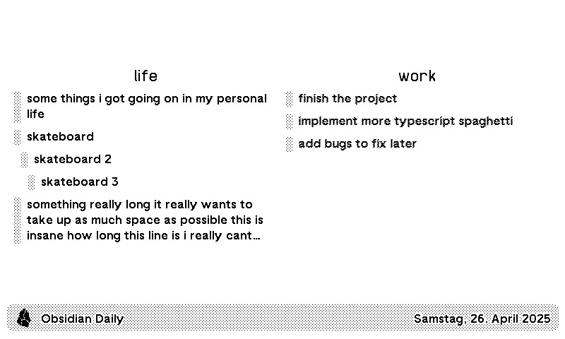
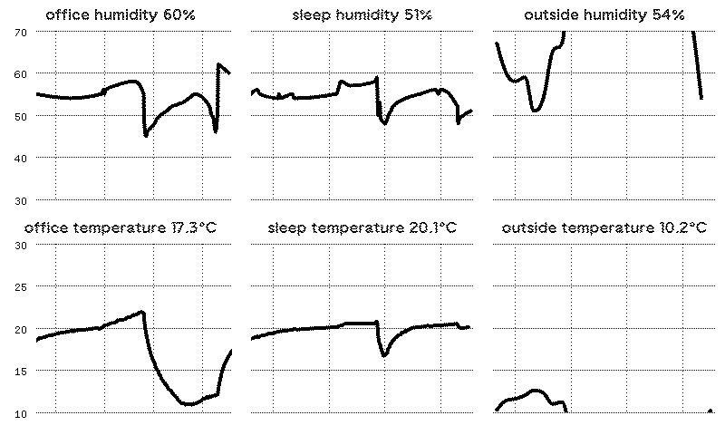
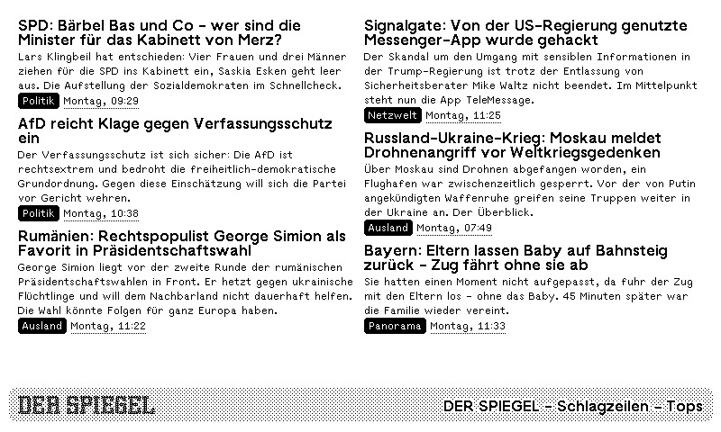

# TRMNL private plugins

This is a playground for the private plugins I've immediately started building when I received my
[TRMNL](https://usetrmnl.com).

It's a bit messy and just intended for my specific use, but can be used as inspiration for your own
plugins.

At the time of writing, this repository contains a [Bun](https://bun.sh) server, which serves data for the following
TRMNL plugins:

- [Obsidian daily notes](#obsidian-daily-notes)
- [Temperature and humidity graphs from Home Assistant](#temperature-and-humidity-graphs-from-home-assistant)
- [News from Spiegel.de](#news-from-spiegelde)

The Bun server is [dockerized](https://www.docker.com/) for easy deployment and local
development is wrangled with [Task](https://taskfile.dev).

On push, the backend server container is [automatically built on GitHub Actions](.github/workflows/deploy-ghcr.yml)
and my Portainer instance gets pinged to update the running container.

## The plugins

### Obsidian daily notes

This plugin shows a 2-column list of my todo list which I manage in [Obsidian](https://obsidian.md).
My notes are synced using the official [Obsidian Sync](https://obsidian.md/sync) and get to my server
via an instance of the [linuxserver/obsidian](https://github.com/linuxserver/docker-obsidian) image.

The first panel displays my personal task list, while the second panel adapts its content
based on the day of the week to show tasks for either my primary job or weekend work.

The markdown looks roughly like this:

```markdown
## work

- [ ] finish the project
- [ ] implement more typescript spaghetti
- [ ] add bugs to fix later

---

## gym

- [ ] work out
- [ ] fix all the software
- [ ] piss off some customers

---

## life

- [ ] some things i got going on in my personal life
- [ ] skateboard
  - [ ] skateboard 2
    - [ ] skateboard 3
- [ ] something really long it really wants to take up as much space as possible this is insane how long this line is i really cant comprehend
```

Which results in the following obsidian screen:



### Temperature and humidity graphs from Home Assistant

This plugin shows a graph of the outside temperature and humidity from my [Home Assistant](https://www.home-assistant.io)
instance.

It uses the [Home Assistant REST API](https://developers.home-assistant.io/docs/api/rest/) to fetch the current sensor data
for the specified entities.

This data is combined with the current weather data from [Brightsky](https://www.brightsky.dev) to make it easily
comparable to the inside conditions.



### News from Spiegel.de

This plugin shows a list of the top stories from [Spiegel.de](https://www.spiegel.de) using
[their RSS feed](https://www.spiegel.de/dienste/besser-surfen-auf-spiegel-online-so-funktioniert-rss-a-1040321.html).



## Repository structure

- [`src`](./src/): source code for the Bun backend server
- [`trmnl-plugin`](./trmnl-plugin/): source code for the TRMNL plugins
- [`.env`/`.env.example`](./.env.example): environment variables for development
- [`taskfile.yml`](./taskfile.yml): task runner configuration
